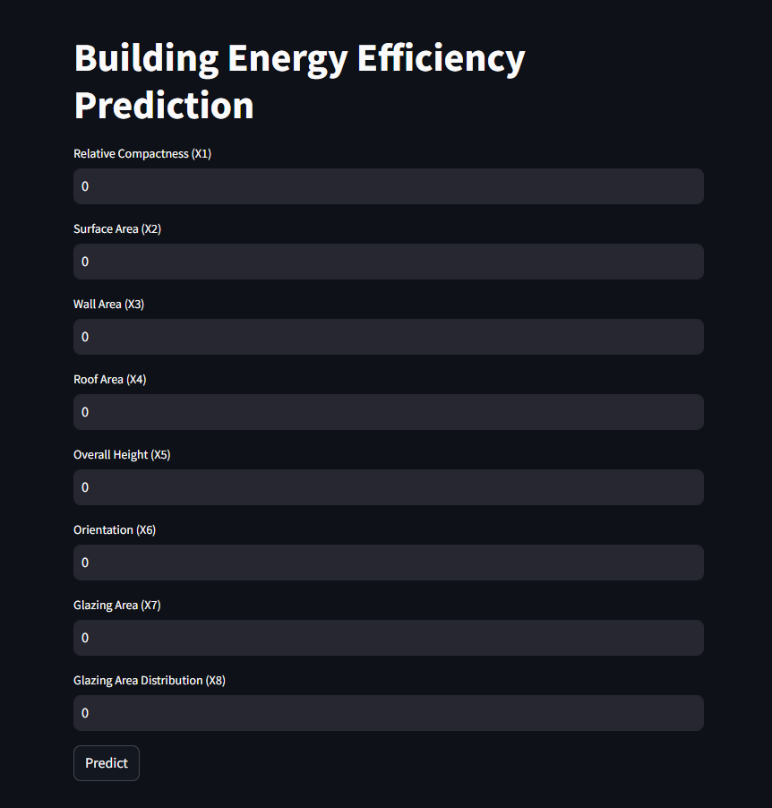

## Building Load Classification<br><br>
[Model development](https://github.com/JeffM-Code/PortfolioWork/tree/main/ML/BuildingEnergyEfficiency)<br><br>
[App](https://buildingloadclassifiermodel.streamlit.app/)<br><br>

Enter variables in text boxes to see whether a building with those variables is classified as having a high or low cooling or heating loads, with higher load values translating into higher energy consumption for heating or cooling.<br><br>

### Example:<br><br>
<br><br>

Sample data from the training set to test accuracy:<br><br>

| Relative Compactness | Surface Area | Wall Area | Roof Area | Overall Height | Orientation | Glazing Area | Glazing Area Distribution | Heating Load | Cooling Load |
|----------------------|--------------|-----------|-----------|----------------|-------------|--------------|---------------------------|--------------|--------------|
| 0.82                 | 612.5        | 318.5     | 147.0     | 7.0            | 2           | 0.1          | 1                         | 23.53        | 27.31        |
| 0.64                 | 784.0        | 343.0     | 220.5     | 3.5            | 4           | 0.4          | 2                         | 18.9         | 22.09        |
| 0.86                 | 588.0        | 294.0     | 147.0     | 7.0            | 4           | 0.25         | 2                         | 29.27        | 29.9         |
| 0.9                  | 563.5        | 318.5     | 122.5     | 7.0            | 4           | 0.25         | 1                         | 32.84        | 32.71        |
| 0.66                 | 759.5        | 318.5     | 220.5     | 3.5            | 5           | 0.1          | 4                         | 11.43        | 14.83        |
| 0.9                  | 563.5        | 318.5     | 122.5     | 7.0            | 2           | 0.25         | 2                         | 32.46        | 35.56        |
| 0.9                  | 563.5        | 318.5     | 122.5     | 7.0            | 5           | 0.4          | 1                         | 35.96        | 40.99        |


<br><br>

#### Model analysis:<br><br>
The code was trained on these thresholds:

```
bins = [0, 10, 20, 40, 100]
labels = ['low', 'medium', 'high', 'very high']

```
<br><br>

Therefore:<br><br>
$$Low: 0 \leq \text{Load} < 10$$<br>
$$Medium: 10 \leq \text{Load} < 20$$<br>
$$High:  20 \leq \text{Load} < 40$$<br>
$$Very High:  40 \leq \text{Load} \leq 100$$<br><br>

### Expected Model Performance:<br><br>
```
Heating Load Classification Accuracy: 96.75%

+--------------+-------------+----------+------------+------------+
|              |   precision |   recall |   f1-score |    support |
|--------------+-------------+----------+------------+------------|
| high         |    0.946667 | 0.986111 |   0.965986 |  72        |
| low          |    1        | 1        |   1        |   4        |
| medium       |    1        | 0.985915 |   0.992908 |  71        |
| very high    |    0.8      | 0.571429 |   0.666667 |   7        |
| accuracy     |    0.967532 | 0.967532 |   0.967532 |   0.967532 |
| macro avg    |    0.936667 | 0.885864 |   0.90639  | 154        |
| weighted avg |    0.965974 | 0.967532 |   0.965676 | 154        |
+--------------+-------------+----------+------------+------------+

Cooling Load Classification Accuracy: 96.75%

+--------------+-------------+----------+------------+------------+
|              |   precision |   recall |   f1-score |    support |
|--------------+-------------+----------+------------+------------|
| high         |    0.975309 | 0.963415 |   0.969325 |  82        |
| medium       |    1        | 0.984127 |   0.992    |  63        |
| very high    |    0.727273 | 0.888889 |   0.8      |   9        |
| accuracy     |    0.967532 | 0.967532 |   0.967532 |   0.967532 |
| macro avg    |    0.90086  | 0.945477 |   0.920442 | 154        |
| weighted avg |    0.970914 | 0.967532 |   0.968706 | 154        |
+--------------+-------------+----------+------------+------------+

```
<br>

* Generally, given classification accuracy is relatively high, it should correctly classify the heating or cooling load well most of the time.